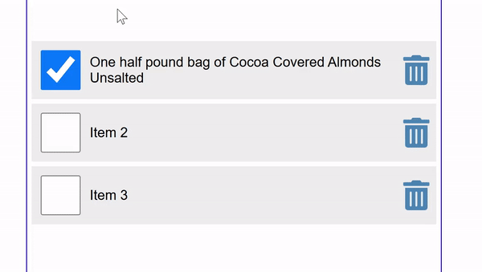

# Lesson 9: Lists and Keys in React

This lesson covers how to dynamically render lists in React and the importance of using unique keys for each list item.

## Features

- **Dynamic List Rendering**: Learn how to display a list of items using the `map()` function.
- **State Updates**: Handle actions like checking off items and deleting items from the list.
- **Keys in Lists**: Understand the role of keys in improving rendering performance and ensuring React can efficiently update the DOM.

### Output Example

