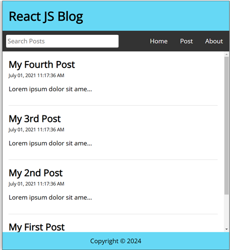

# Lesson 15: React Router Hooks and Links

This lesson demonstrates how to use **React Router Hooks** and **Links** for enhanced navigation in a React application.

## Features

- **React Router Hooks**:

  - **useNavigate**: Programmatically navigate between routes.
  - **useParams**: Extract dynamic parameters from the URL.

- **Links**:

  - **Link Component**: Creates navigation links without reloading the page, maintaining a seamless SPA experience.

- **Routing**:

  - **Home Page**: Displays the homepage at the root route.
  - **New Post Page**: Accessible at `/new-post` to create new posts.
  - **Post Page**: Displays individual posts using dynamic URL parameters.
  - **About Page**: Provides app information at `/about`.
  - **Missing Page**: A 404-style page for unknown routes.

- **Navigation**:
  - Uses **Link** components for declarative navigation.
  - Demonstrates **useNavigate** for programmatic routing.

### Output Example

 