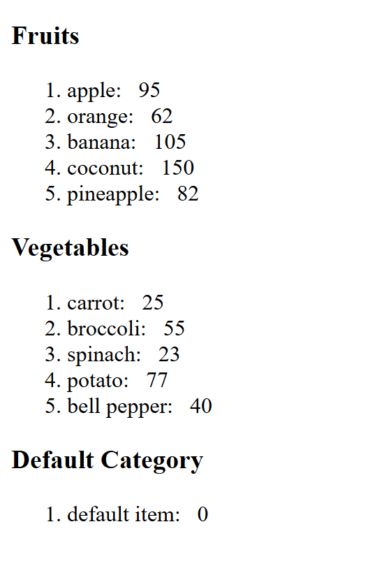

# Lesson 6: Render Lists

This lesson covers:

- **Dynamic List Rendering** using React's `.map()`.
- **Reusable Components** with props for customization.
- **Sorting and Filtering** for tailored list displays.

---

### Output Example

