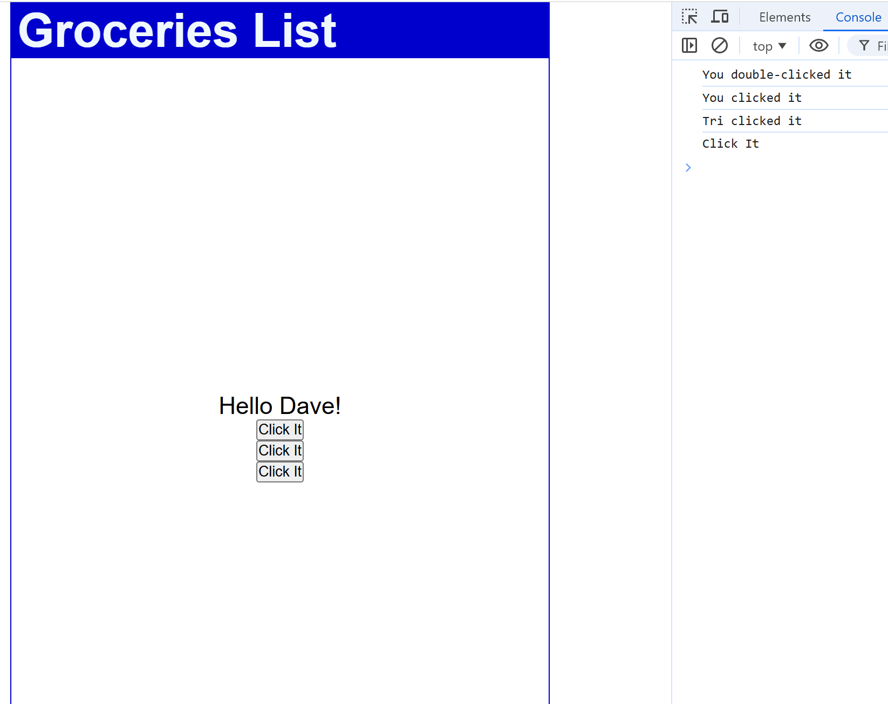

# Lesson 7: Click Events

This lesson demonstrates handling various click events in React, including single clicks, double clicks, passing parameters, and using the event object.

## Features

- **Dynamic Content**: `handleNameChange` selects a random name to display.
- **Basic Click**: Logs a message with `handleClick`.
- **Parameterized Click**: Passes data like a name with `handleClick2`.
- **Event Object**: Accesses event details with `handleClick3`.
- **Double Click**: Logs a message for double-clicks with `handleDoubleClick`.

### Output Example

