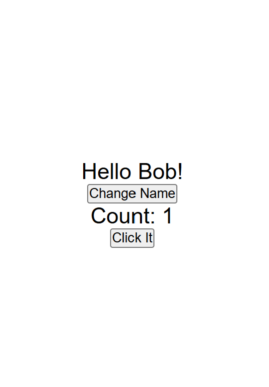

# Lesson 8: useState Hook

This lesson demonstrates the usage of the `useState` hook in React to manage dynamic state updates, such as changing names and incrementing a counter.

## Features

- **Dynamic Name Change**: `handleNameChange` updates the displayed name randomly from a predefined list.
- **Counter Update**: `handleClick` increments a counter value stored in state.

### Output Example

